# Mermaid Rendering Test

## Test 1 — basic flowchart

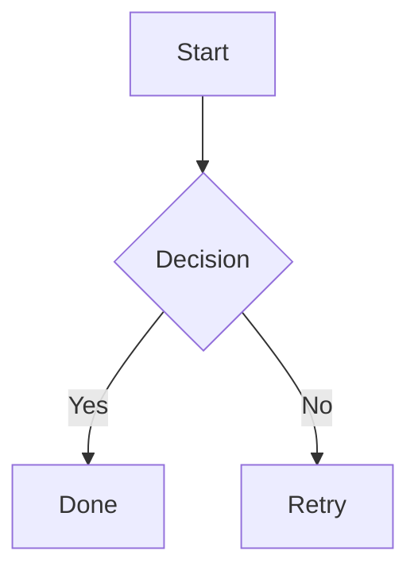

## Test 2 — subgraph with quoted title

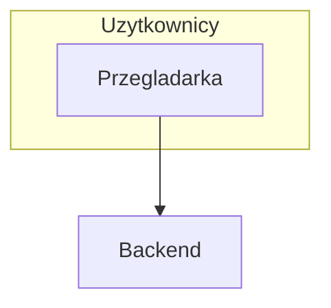

## Test 3 — subgraph without quotes

## Test 4 — database cylinder shape

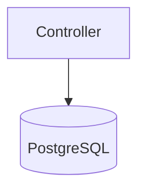

## Test 5 — chained arrows

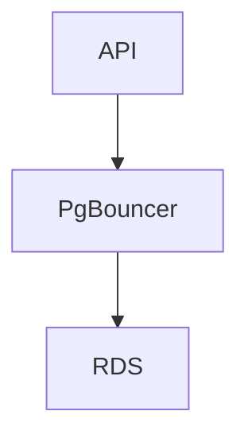

## Test 6 — edge label with slash

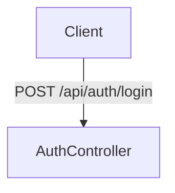

## Test 7 — unicode arrow in node

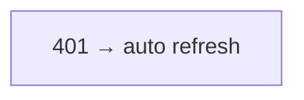

## Test 8 — unicode arrow replaced

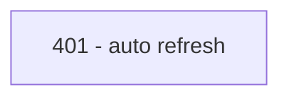

## Test 9 — Polish diacritics in edge label

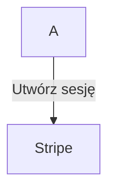

## Test 10 — arrow to subgraph

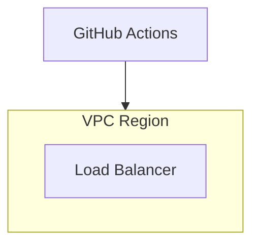

## Test 11 — sequence diagram

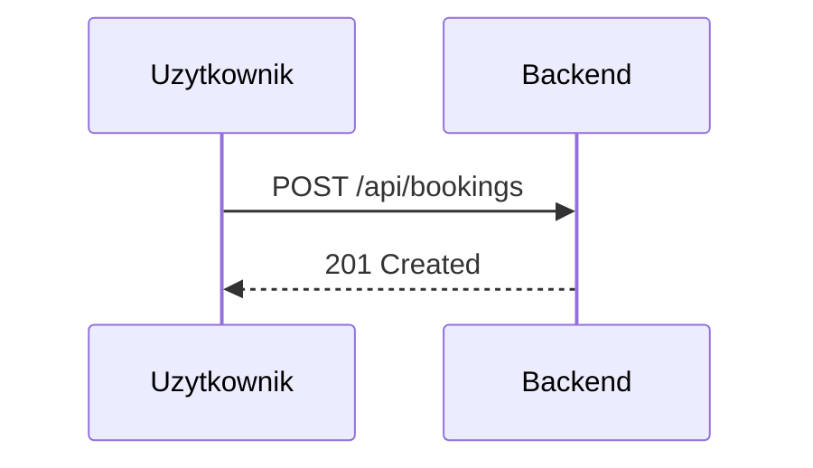

## Test 12 — complex subgraph from README

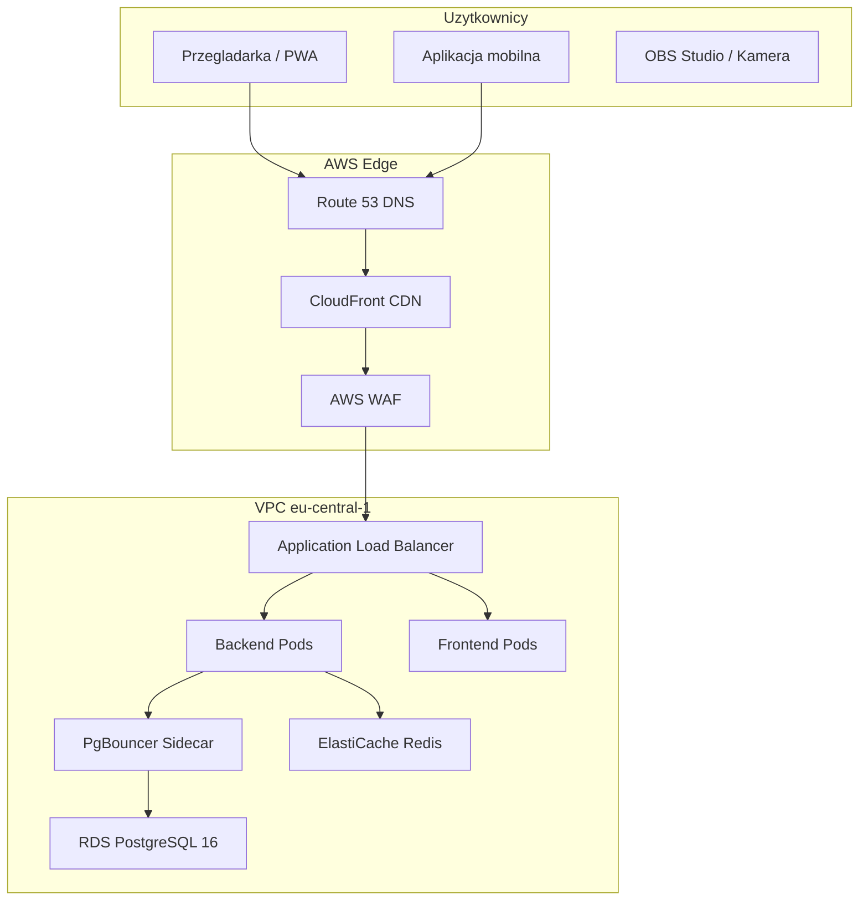
