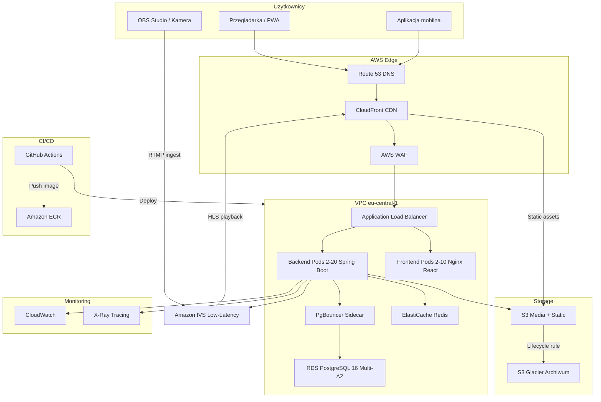
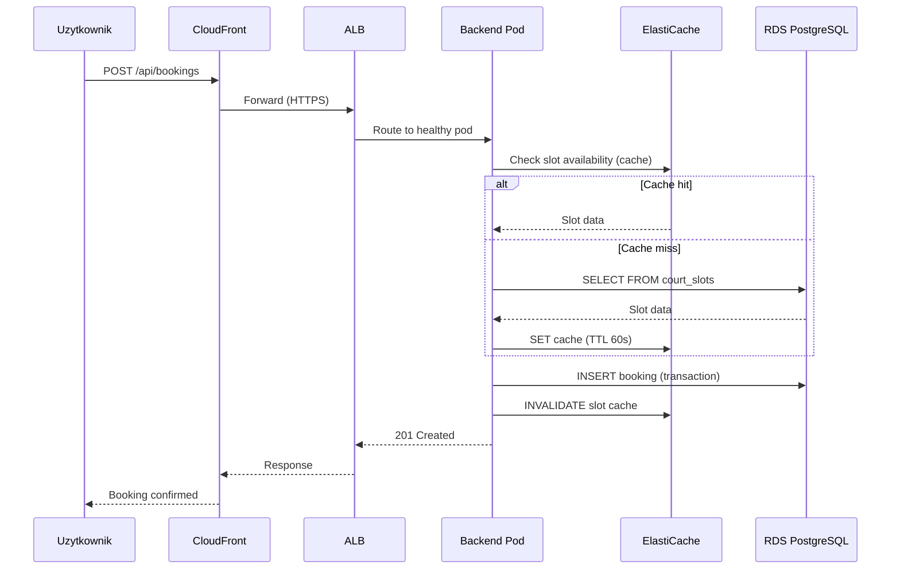
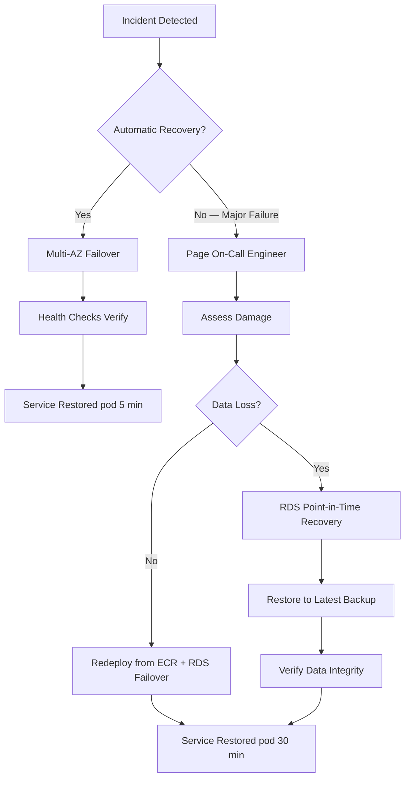
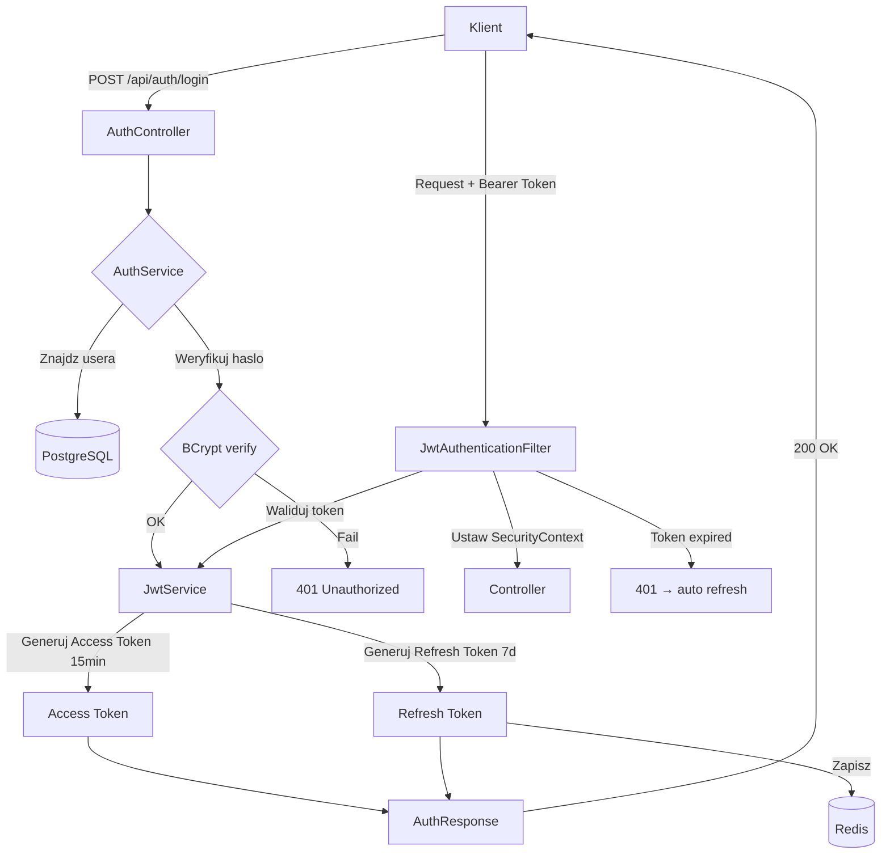
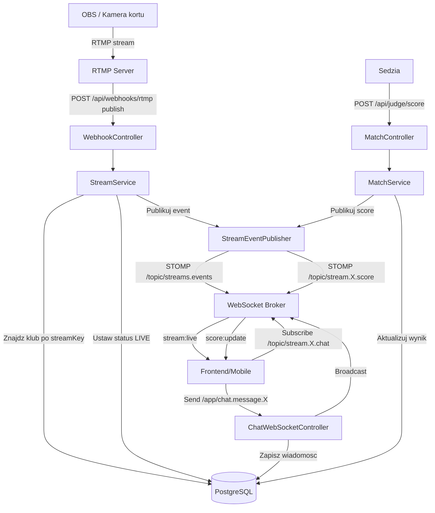
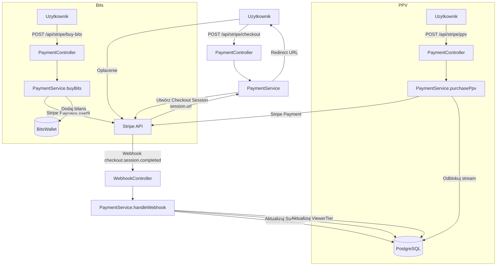
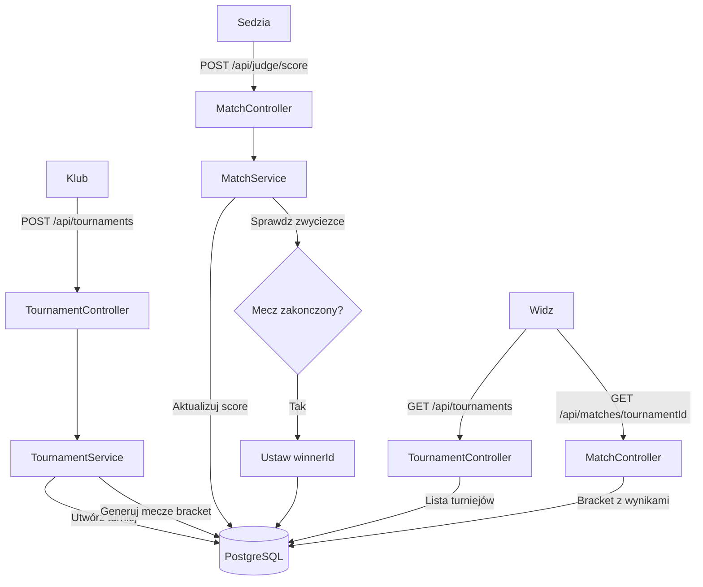
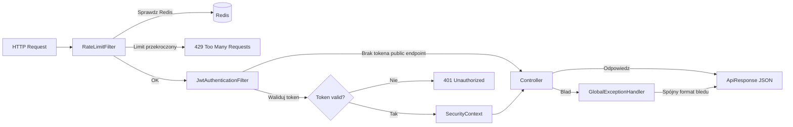

# Padel Vision

> Kompleksowa platforma do zarzadzania klubami padel, rezerwacji kortow, transmisji meczow na zywo i analizy statystyk graczy. Zbudowana w architekturze mikroserwisowej, zoptymalizowana pod katem skalowalnosci i niskich kosztow operacyjnych.


---

## Spis tresci

- [Szybki start (Instrukcje lokalne)](#szybki-start-instrukcje-lokalne)
- [Architektura systemu](#architektura-systemu)
- [Uslugi AWS — szczegolowy opis](#uslugi-aws--szczegolowy-opis)
- [Skalowanie](#skalowanie)
- [Koszty — 3 scenariusze](#koszty--3-scenariusze)
- [Disaster Recovery i SLA](#disaster-recovery-i-sla)
- [Flowcharty Backend](#flowcharty-backend)
- [Dokumentacja API](#dokumentacja-api)

> **Diagramy Mermaid** — ten README zawiera interaktywne diagramy w formacie [Mermaid](https://mermaid.js.org/). Na **GitHub** renderuja sie automatycznie. Lokalnie zainstaluj plugin:
> - **VS Code**: [Markdown Preview Mermaid Support](https://marketplace.visualstudio.com/items?itemName=bierner.markdown-mermaid)
> - **IntelliJ / WebStorm**: wbudowana obsluga w podgladzie Markdown (Settings → Languages → Markdown → Mermaid)
> - **CLI**: `npm install -g @mermaid-js/mermaid-cli` → `mmdc -i README.md -o diagram.svg`

---

## Szybki start (Instrukcje lokalne)

### Wymagania

- Docker >= 24.x i Docker Compose >= 2.20
- Java 21+ (dla backendu bez Dockera)
- Node.js 20+ (dla frontendu bez Dockera)
- Git

### Uruchomienie calego srodowiska

```bash
# 1. Klonowanie repozytorium
git clone https://github.com/your-org/padel-vision.git
cd padel-vision

# 2. Konfiguracja zmiennych srodowiskowych
cp backend/.env.example backend/.env
cp frontend/.env.example frontend/.env

# 3. Uruchomienie wszystkich mikroserwisow
docker compose -f docker-compose.microservices.yml up -d
```

### Budowanie poszczegolnych komponentow

```bash
# Build backend only
cd backend && ./mvnw clean package -DskipTests
docker build -t padelvision-backend:latest .

# Build frontend only
cd frontend && npm ci && npm run build
docker build -t padelvision-frontend:latest .
```

### Srodowisko testowe

```bash
# Uruchomienie srodowiska testowego z osobna baza danych i seedami
docker compose -f docker-compose.microservices.yml -f docker-compose.test.yml up -d --build
```

### Weryfikacja

```bash
# Sprawdzenie statusu kontenerow
docker compose -f docker-compose.microservices.yml ps

# Health check backendu
curl http://localhost:8080/actuator/health

# Frontend dostepny pod
open http://localhost:3000
```

---

## Architektura systemu

### Diagram ogolny



### Przeplyw danych — rezerwacja kortu



---

## Uslugi AWS — szczegolowy opis

### COMPUTE

| Usluga | Rola w projekcie | Uzasadnienie wyboru |
|---------|-----------------|---------------------|
| **Amazon EKS** | Orkiestracja kontenerow — uruchamia pody backendu (Spring Boot) i frontendu (Nginx + React). HPA automatycznie skaluje liczbe podow na podstawie CPU i custom metrics. | **Dlaczego nie ECS?** EKS daje pelna kontrole nad konfiguracjami Kubernetes (HPA, VPA, KEDA, PgBouncer sidecar, liveness/readiness probes). ECS jest prostszy, ale ogranicza mozliwosci customizacji networking i sidecar patterns. **Dlaczego nie EC2?** Reczne zarzadzanie instancjami, brak auto-healing podow, znacznie wiekszy overhead operacyjny. EKS z managed node groups (Spot instances) zapewnia optymalny stosunek kosztow do elastycznosci. |
| **Amazon ECR** | Prywatny rejestr obrazow Docker. Kazdy push na `main` triggeruje build w GitHub Actions i publikuje nowy obraz tagowany SHA commita. | Natywna integracja z EKS (brak potrzeby konfiguracji credentials), skanowanie obrazow pod katem CVE, lifecycle policies automatycznie usuwaja stare obrazy. |

### NETWORKING

| Usluga | Rola w projekcie | Uzasadnienie wyboru |
|---------|-----------------|---------------------|
| **Route 53** | DNS management — mapowanie domeny `padelvision.pl` na CloudFront distribution. Health checks z automatycznym failover. | Natywna integracja z innymi uslugami AWS (alias records dla CloudFront/ALB), latency-based routing dla przyszlej ekspansji multi-region. |
| **CloudFront** | CDN — serwowanie statycznych assetow (React bundle, media), cachowanie odpowiedzi API (GET endpoints), terminacja TLS na krawedzi. Obsluguje tez HLS playback z IVS. | Redukuje latency o ~60% dla uzytkownikow w Polsce (edge location we Frankfurcie). Absorbuje >90% ruchu statycznego, odciazajac ALB i pody. |
| **Application Load Balancer** | Routing HTTP/HTTPS do podow EKS. Path-based routing: `/api/*` -> backend, `/*` -> frontend. Health checks co 10s. Sticky sessions dla WebSocket. | ALB (nie NLB) — potrzebujemy path-based routing, WebSocket support i integracji z WAF. NLB operuje na warstwie 4 i nie obsluguje tych funkcji. |
| **VPC** | Izolacja sieciowa. 2 publiczne subnety (ALB, NAT Gateway) + 2 prywatne subnety (EKS, RDS, ElastiCache) w 2 Availability Zones. | **Public subnets**: tylko ALB i NAT Gateway sa dostepne z internetu. **Private subnets**: pody, baza danych i cache sa calkowicie izolowane. Security Groups ograniczaja ruch do wymaganych portow (np. 5432 tylko z podow backendowych). **NAT Gateway**: umozliwia podom w prywatnych subnetach dostep do internetu (pull obrazow, zewnetrzne API) bez ekspozycji. |

### STORAGE & DATABASE

| Usluga | Rola w projekcie | Uzasadnienie wyboru |
|---------|-----------------|---------------------|
| **RDS PostgreSQL 16 Multi-AZ** | Glowna baza danych — uzytkownicy, kluby, rezerwacje, mecze, statystyki. Multi-AZ zapewnia automatyczny failover (<60s). Automated backups co 30 dni. | **Dlaczego nie Aurora?** Aurora PostgreSQL jest ~2x drozsza przy malej skali (min. ~$60/mo vs ~$29/mo dla `db.t4g.micro`). Aurora oplacalaby sie dopiero przy >50,000 DAU gdzie auto-scaling storage i szybsze read replicas daja przewage. Dla naszego range (1k-200k users) RDS Multi-AZ zapewnia wystarczajaca dostepnosc (99.95% SLA) przy znacznie nizszych kosztach. |
| **ElastiCache Redis** | Cache warstwy aplikacyjnej — sesje uzytkownikow, dostepnosc kortow, leaderboardy, rate limiting. Pub/Sub dla WebSocket broadcasting (sticky sessions). | Redis (nie Memcached) — potrzebujemy sorted sets (leaderboardy), pub/sub (real-time updates), persistence (sesje nie gina przy restarcie). ElastiCache (nie self-hosted) — zarzadzane patche, Multi-AZ, automatyczne backupy. |
| **S3** | Storage plikow — zdjecia profilowe, nagrania meczow, statyczne assety frontendu. **Presigned URLs** dla bezpiecznego uploadu bezposrednio z przegladarki (bez przechodzenia przez backend). **Lifecycle rules**: po 90 dniach nagrania migruja do S3 Glacier (redukcja kosztow ~80%). | S3 jest de facto standardem dla object storage. Presigned URLs eliminuja bottleneck backendu przy uploadach duzych plikow (nagrania meczow do kilku GB). |
| **CloudFront + S3** | Static hosting — React build serwowany bezposrednio z S3 przez CloudFront. Origin Access Control zapobiega bezposredniemu dostepowi do bucketa. | Eliminuje potrzebe serwowania statycznych plikow z podow EKS. Koszt ~$0.02/GB vs ~$0.09/GB przez ALB. |

### STREAMING

| Usluga | Rola w projekcie | Uzasadnienie wyboru |
|---------|-----------------|---------------------|
| **Amazon IVS** | Transmisja meczow na zywo. Kamery/OBS streamuja przez RTMP ingest, IVS transkoduje do HLS (adaptive bitrate), uzytkownicy ogladaja przez CloudFront z opoznieniem <3s. | **Dlaczego nie nginx-rtmp?** Self-hosted streaming wymaga: zarzadzania transkodowaniem (ffmpeg), auto-skalowania w pikach (finaly turnieju), edge distribution (latency), DRM/tokenization. IVS robi to wszystko out-of-the-box. Koszt: $2/h za kanal basic + $0.20/h za kazde 100 viewers. Przy 5 jednoczesnych streamach: ~$40/mo (small) — znacznie taniej niz utrzymanie wlasnej infrastruktury streamingowej nawet na 1 serwerze EC2. |

### MONITORING

| Usluga | Rola w projekcie | Uzasadnienie wyboru |
|---------|-----------------|---------------------|
| **CloudWatch** | **Logs**: centralne logowanie ze wszystkich podow (structured JSON, 30-day retention). **Metrics**: CPU, memory, request count, latency percentiles (p50/p95/p99). **Alarms**: notyfikacje do Slack/PagerDuty przy p99 > 500ms, error rate > 5%, CPU > 80%. **Dashboards**: real-time widok statusu systemu. | Natywna integracja z EKS (Fluent Bit DaemonSet), RDS, ElastiCache. Brak potrzeby utrzymywania Prometheus/Grafana stack (obniza operational overhead). |
| **X-Ray** | Distributed tracing — sledzenie requestow przez caly lancuch: ALB -> Backend -> Redis/PostgreSQL -> S3. Identyfikacja bottleneckow i slow queries. | Spring Boot integracja przez `aws-xray-sdk-spring`. Pozwala zobaczyc dokladnie gdzie jest latency: czy w bazie danych, cache, czy logice biznesowej. Kluczowe dla optymalizacji performance. |

### SECURITY

| Usluga | Rola w projekcie | Uzasadnienie wyboru |
|---------|-----------------|---------------------|
| **AWS WAF** | Web Application Firewall na CloudFront — ochrona przed SQL injection, XSS, DDoS (rate limiting 2000 req/5min per IP), geo-blocking (opcjonalnie). Managed rule groups: AWSManagedRulesCommonRuleSet, AWSManagedRulesSQLiRuleSet. | WAF na CloudFront blokuje ataki zanim dotra do ALB/podow, redukujac load i koszty. |
| **ACM** | SSL/TLS — darmowe certyfikaty dla `*.padelvision.pl`. Auto-renewal co 13 miesiecy. Certyfikaty przypiete do CloudFront i ALB. | Zerowy koszt, automatyczne odnawianie — zero maintenance. |
| **Secrets Manager** | Bezpieczne przechowywanie: database credentials, Redis password, JWT secret, API keys (IVS, Stripe, external services). Automatic rotation co 30 dni dla DB credentials. | Secrets nigdy nie sa w env vars ani w kodzie. IRSA (IAM Roles for Service Accounts) pozwala podom na dostep do sekretow bez static credentials. |
| **IAM (IRSA)** | IAM Roles for Service Accounts — kazdy pod EKS ma dedykowana role IAM z minimalnymi uprawnieniami (least privilege). Backend pod: S3 read/write, IVS manage, Secrets Manager read. Frontend pod: brak uprawnien AWS. | IRSA eliminuje potrzebe przechowywania AWS credentials w podach. Kazdy service account ma role z dokladnie tymi uprawnieniami, ktore potrzebuje — nic wiecej. |

### CI/CD

| Usluga | Rola w projekcie | Uzasadnienie wyboru |
|---------|-----------------|---------------------|
| **GitHub Actions + ECR + EKS** | Pipeline: `push to main` -> run tests -> build Docker image -> push to ECR (tag: git SHA) -> rolling update EKS deployment (zero-downtime). Preview environments na PR-ach (namespace per PR). | GitHub Actions — brak dodatkowych kosztow (darmowe minuty dla public repos), natywna integracja z GitHub (PR checks, environments, secrets). ArgoCD rozwazone — dodaje GitOps, ale zwieksza complexity. Na obecnym etapie GitHub Actions + `kubectl apply` jest wystarczajace. |

---

## Skalowanie

### Skalowanie horyzontalne (Horizontal Scaling)

| Komponent | Strategia | Parametry |
|-----------|-----------|-----------|
| **Backend Pods** | HPA (Horizontal Pod Autoscaler) | Min: **2**, Max: **20**. Scale-up: CPU > 70% LUB custom metric requests/s > 500. Scale-down: 5 min stabilization window. |
| **Frontend Pods** | HPA | Min: **2**, Max: **10**. Scale-up: CPU > 70%. Frontend jest stateless — skalowanie jest trywialne. |
| **SQS Consumers** | KEDA (Kubernetes Event-Driven Autoscaler) | Skalowanie na podstawie dlugosci kolejki SQS. Np. email notifications, video processing jobs. Scale to zero gdy kolejka pusta. |
| **EKS Nodes** | Cluster Autoscaler / Karpenter | Automatyczne dodawanie/usuwanie node'ow EC2 gdy pody nie maja zasobow. Spot instances dla non-critical workloads (oszczednosc ~60%). |

### Skalowanie wertykalne (Vertical Scaling)

| Komponent | Strategia | Parametry |
|-----------|-----------|-----------|
| **Backend Pods** | VPA (Vertical Pod Autoscaler) | Rekomendacje zasobow na podstawie historical usage. Mode: `Off` (tylko rekomendacje) — nie chcemy auto-restart podow. |
| **RDS PostgreSQL** | Instance upgrade | `db.t4g.micro` (small) -> `db.r6g.xlarge` (medium) -> `db.r6g.4xlarge` (large). Upgrade z ~5min downtime w maintenance window. |
| **ElastiCache Redis** | Shard scaling | Dodawanie shardow (partycjonowanie danych) lub upgrade instancji. Online resharding bez downtime. |

### Skalowanie bazy danych

```
Uzytkownicy     Strategia
-----------     ---------
< 1,000         PgBouncer sidecar (100 connections/pod), 1x RDS Multi-AZ
1,000-10,000    + Connection pooling tuning (max 200/pod)
10,000-50,000   + Read Replicas (1-2) dla raportow i leaderboardow
> 50,000        + RDS Proxy (managed connection pooling), 3+ Read Replicas
> 100,000       Rozwazyc migracje do Aurora PostgreSQL (auto-scaling storage, 15 read replicas)
```

| Warstwa | Rozwiazanie | Opis |
|---------|-------------|------|
| **Connection Pooling** | PgBouncer sidecar | Kazdy backend pod ma PgBouncer sidecar utrzymujacy pool 100 polaczen. Zapobiega wyczerpaniu limitu polaczen RDS (max ~1000 dla `db.r6g.xlarge`). |
| **Read Replicas** | RDS Read Replicas | Wdrazane przy >1,000 jednoczesnych uzytkownikow. Odciazaja primary instance od zapytan SELECT (raporty, statystyki, leaderboardy). Spring Boot: `@Transactional(readOnly=true)` automatycznie routuje do repliki. |
| **Managed Pooling** | RDS Proxy | Rozwazone przy >50,000 uzytkownikow. Zarzadzany connection pooler od AWS — eliminuje potrzebe PgBouncer, lepsze failover handling. |

### Skalowanie streamingu

| Aspekt | Rozwiazanie |
|--------|-------------|
| **IVS** | Automatyczne skalowanie — AWS zarzadza infrastruktura transkodowania i dystrybucji. Brak potrzeby manualnej interwencji. |
| **WebSocket** | Sticky sessions na ALB (session affinity) + Redis Pub/Sub. Kazdy pod subskrybuje kanaly Redis i broadcastuje do swoich lokalnych WebSocket connections. |
| **HLS Playback** | CloudFront cachuje segmenty HLS — eliminuje load na IVS przy wielu viewerach ogladajacych ten sam stream. |

### Skalowanie CDN

| Metryka | Wartosc |
|---------|---------|
| **Static traffic offload** | CloudFront absorbuje >90% ruchu statycznego (JS, CSS, images, fonts) |
| **Large file uploads** | S3 Transfer Acceleration dla uploadow nagrania meczow z odleglych lokalizacji |
| **Cache hit ratio** | Target: >95% dla statycznych assetow, >60% dla cacheable API responses |

---

## Koszty — 3 scenariusze

> Wszystkie ceny w USD/miesiac, region `eu-central-1` (Frankfurt). Ceny na marzec 2026.

### Scenariusz SMALL (~$290/mies.)

**Parametry**: 1,000 uzytkownikow, 100 GB storage, 10 GB egress, 5 jednoczesnych streamow (peak)

| Usluga | Specyfikacja | Koszt/mies. |
|--------|-------------|-------------|
| EKS Control Plane | 1 cluster | $73 |
| EC2 (Spot Instances) | 2x `t3.medium` spot (~60% discount) | $33 |
| ALB | 1 ALB + ~10 LCU | $18 |
| NAT Gateway | 1x NAT + ~10 GB data processing | $34 |
| RDS PostgreSQL | `db.t4g.micro` Multi-AZ | $58 |
| ElastiCache Redis | `cache.t4g.micro` | $12 |
| S3 | 100 GB Standard | $5 |
| Amazon IVS | 5 channels basic, ~200 viewer-hours | $40 |
| CloudFront | 10 GB transfer | $2 |
| ECR | ~5 GB images | $1 |
| Route 53 | 1 hosted zone + queries | $1 |
| CloudWatch | Logs + basic metrics | $10 |
| Secrets Manager | ~5 secrets | $3 |
| ACM | Certyfikaty SSL | $0 |
| **SUMA** | | **~$290** |

---

### Scenariusz MEDIUM (~$2,242/mies.)

**Parametry**: 25,000 uzytkownikow, 2 TB storage, 500 GB egress, 50 jednoczesnych streamow (peak)

| Usluga | Specyfikacja | Koszt/mies. |
|--------|-------------|-------------|
| EKS Control Plane | 1 cluster | $73 |
| EC2 (Spot + On-Demand mix) | 4x `t3.xlarge` (2 spot, 2 on-demand) | $210 |
| ALB | 1 ALB + ~50 LCU | $40 |
| NAT Gateway | 2x NAT + ~100 GB data processing | $80 |
| RDS PostgreSQL | `db.r6g.large` Multi-AZ + 1 Read Replica | $290 |
| ElastiCache Redis | `cache.r6g.large` (1 shard) | $130 |
| S3 | 2 TB Standard + lifecycle to Glacier | $46 |
| Amazon IVS | 50 channels, ~5,000 viewer-hours | **$1,089** |
| CloudFront | 500 GB transfer | $52 |
| ECR | ~20 GB images | $2 |
| Route 53 | 1 hosted zone + queries | $2 |
| CloudWatch | Logs + detailed metrics + dashboards | $100 |
| Secrets Manager | ~10 secrets | $5 |
| X-Ray | Traces sampling 10% | $20 |
| WAF | Basic rules | $3 |
| **SUMA** | | **~$2,242** |

> **IVS stanowi ~49% calkowitych kosztow** — streaming jest najdrozszym komponentem przy sredniej skali.

---

### Scenariusz LARGE (~$14,611/mies.)

**Parametry**: 200,000 uzytkownikow, 20 TB storage, 10 TB egress, 500 jednoczesnych streamow (peak)

| Usluga | Specyfikacja | Koszt/mies. |
|--------|-------------|-------------|
| EKS Control Plane | 1 cluster | $73 |
| EC2 (Mixed fleet) | 20x mixed instances (Spot + On-Demand + RI) | $1,400 |
| ALB | 2 ALB + ~200 LCU | $120 |
| NAT Gateway | 2x NAT + ~1 TB data processing | $340 |
| RDS PostgreSQL | `db.r6g.4xlarge` Multi-AZ + 3 Read Replicas | $1,800 |
| RDS Proxy | Managed connection pooling | $90 |
| ElastiCache Redis | `cache.r6g.xlarge` (3 shards) | $520 |
| S3 | 20 TB Standard + Glacier | $400 |
| Amazon IVS | 500 channels, ~100,000 viewer-hours | **$8,340** |
| CloudFront | 10 TB transfer + Transfer Acceleration | $850 |
| ECR | ~50 GB images | $5 |
| Route 53 | 1 hosted zone + health checks | $5 |
| CloudWatch | Full monitoring stack + X-Ray | $450 |
| Secrets Manager | ~20 secrets | $8 |
| WAF | Full rule set + rate limiting | $10 |
| Shield Advanced | DDoS protection | $200 |
| **SUMA** | | **~$14,611** |

> **IVS stanowi ~57% calkowitych kosztow** — przy duzej skali streaming calkowicie dominuje budzet.

---

### Porownanie scenariuszy

| Metryka | Small | Medium | Large |
|---------|-------|--------|-------|
| Uzytkownicy | 1,000 | 25,000 | 200,000 |
| Storage | 100 GB | 2 TB | 20 TB |
| Egress | 10 GB | 500 GB | 10 TB |
| Streamy (peak) | 5 | 50 | 500 |
| **Koszt/mies.** | **~$290** | **~$2,242** | **~$14,611** |
| Koszt/uzytkownik | $0.29 | $0.09 | $0.07 |
| IVS % budzetu | 14% | 49% | 57% |
| Compute % budzetu | 37% | 13% | 10% |
| Database % budzetu | 24% | 19% | 17% |

---

### 7 wskazowek optymalizacji kosztow

| # | Wskazowka | Oszczednosc |
|---|-----------|-------------|
| 1 | **Spot Instances** dla backend podow (non-critical). Karpenter automatycznie przechodzi na On-Demand gdy Spot niedostepny. | do 60% na EC2 |
| 2 | **Reserved Instances / Savings Plans** na RDS i baseline EC2. 1-year RI = ~30% discount, 3-year = ~50%. | 30-50% na RDS/EC2 |
| 3 | **S3 Lifecycle Policies**: Standard -> Infrequent Access (30d) -> Glacier (90d) -> Glacier Deep Archive (365d). | do 80% na storage |
| 4 | **IVS channel management**: automatyczne tworzenie/usuwanie kanalow. Nie plac za idle channels. Nizsze rozdzielczosci dla mniej popularnych streamow. | 20-40% na IVS |
| 5 | **CloudFront caching**: agresywne cache-control headers, kompresja Brotli. Wiecej cache hits = mniej origin requests = nizsze koszty ALB/EKS. | 10-20% na transfer |
| 6 | **Right-sizing**: VPA rekomendacje co tydzien. Nie over-provisionuj — zacznij od malych instancji i skaluj w gore na podstawie metryk. | 15-30% na compute |
| 7 | **NAT Gateway optimization**: ECR pull-through cache (unikaj powtornych pobrania obrazow), VPC endpoints dla S3/DynamoDB/ECR (ruch nie przechodzi przez NAT). | do 50% na NAT |

---

## Disaster Recovery i SLA

### Cele dostepnosci

| Metryka | Wartosc | Opis |
|---------|---------|------|
| **RPO** (Recovery Point Objective) | < 1 godzina | Maksymalna akceptowalna utrata danych. Automated RDS backups co godzine + WAL archiving. |
| **RTO** (Recovery Time Objective) | < 30 minut | Maksymalny czas przywracania uslugi. Multi-AZ failover <60s + EKS pod restart <2min. |
| **SLA** | 99.9% uptime | ~8.7h downtime/rok. Pokrywane przez Multi-AZ i auto-healing. |

### Mechanizmy odpornosci

```
Warstwa          Mechanizm                      Opis
-------          ---------                      ----
APPLICATION      Circuit Breaker (Resilience4j) Otwarcie obwodu po 5 bledach w 10s.
                                                 Fallback responses, half-open po 30s.
                 Graceful Shutdown               30s drain period — pody koncza biezace
                                                 requesty przed zamknieciem.
                 Retry + Backoff                 Exponential backoff dla zewnetrznych API.
                 Rate Limiting                   Redis-backed, 100 req/min per user.

DATABASE         Multi-AZ                        Automatyczny failover RDS w <60s.
                 Automated Backups               Codzienne snapshoty, retencja 30 dni.
                                                 Point-in-time recovery do dowolnej sekundy.
                 Connection Pooling              PgBouncer absorbuje spikes polaczen
                                                 podczas failover.

STORAGE          S3 Versioning                   Kazdy obiekt ma wersje — ochrona przed
                                                 przypadkowym usunieciem/nadpisaniem.
                 Cross-Region Replication         Krytyczne dane (backupy, konfiguracje)
                                                 replikowane do eu-west-1 (Irlandia).
                 MFA Delete                      Usuwanie wersji wymaga MFA — ochrona
                                                 przed zlossliwym usunieciem.

CACHE            Redis Multi-AZ                  Automatyczny failover repliki Redis.
                 Cache-aside Pattern             Aplikacja dziala bez cache (wolniej),
                                                 graceful degradation.

NETWORKING       Multi-AZ Deployment             Wszystkie komponenty w 2+ AZ.
                 Health Checks                   ALB, Route 53, EKS — automatyczne
                                                 usuwanie niezdrowych instancji.
```

### Procedura Disaster Recovery



---

## Dokumentacja API

| Zasob | URL | Opis |
|-------|-----|------|
| **Swagger UI** | [`/api/docs/swagger`](http://localhost:8080/api/docs/swagger) | Interaktywna dokumentacja API — testowanie endpointow bezposrednio z przegladarki. |
| **OpenAPI Spec** | [`/api/docs`](http://localhost:8080/api/docs) | Specyfikacja OpenAPI 3.0 w formacie JSON — do importu w Postman, generowania klientow SDK. |

### Glowne grupy endpointow

| Grupa | Prefix | Opis |
|-------|--------|------|
| Auth | `/api/auth/*` | Rejestracja, logowanie, odswiezanie tokenow JWT |
| Users | `/api/users/*` | Profile uzytkownikow, ustawienia |
| Clubs | `/api/clubs/*` | Zarzadzanie klubami, czlonkostwo |
| Courts | `/api/courts/*` | Korty, dostepnosc, konfiguracja |
| Bookings | `/api/bookings/*` | Rezerwacje, anulowanie, historia |
| Matches | `/api/matches/*` | Mecze, wyniki, statystyki |
| Streams | `/api/streams/*` | Transmisje na zywo, konfiguracja IVS |
| Leaderboards | `/api/leaderboards/*` | Rankingi graczy, punktacja |

---

## Flowcharty Backend

### Proces autentykacji (JWT)



### Proces streamowania na zywo



### Proces platnosci (Stripe)



### Proces turnieju



### Pipeline request — rate limiting i security



---

> **Padel Vision** — zbudowany z mysla o skalowalnosci, bezpieczenstwie i optymalnych kosztach operacyjnych.
